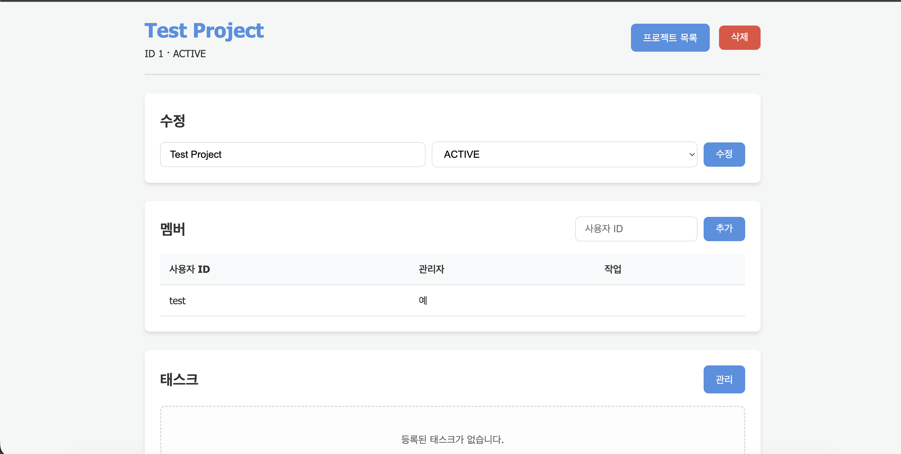
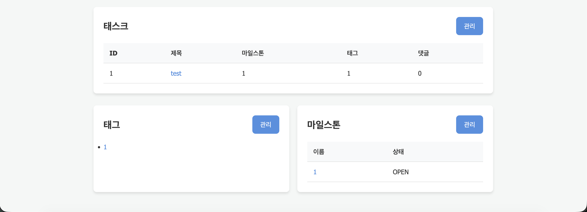
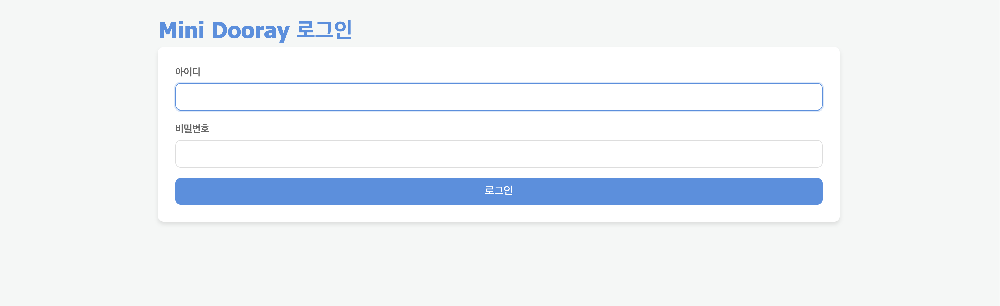
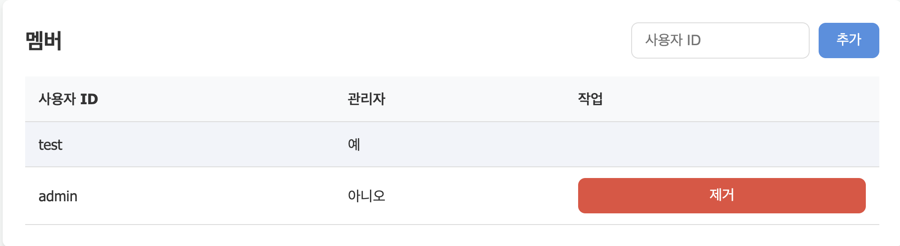
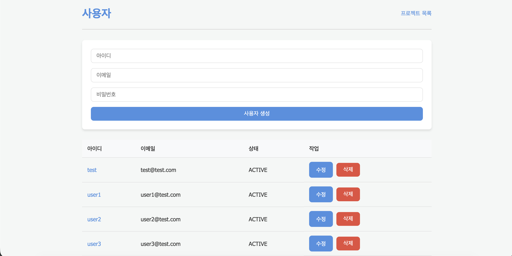

# Mini Dooray 개인 재구성 프로젝트

프로젝트와 태스크를 관리할 수 있는 협업 도구를 서비스별로 분리하여 구현한 Spring Boot 기반 학습 프로젝트입니다.

NHN Academy 팀 프로젝트 당시에는 **Eureka Server**와 **API Gateway**를 담당했습니다. 프로젝트 종료 후에는 서비스 간 요청 흐름과 각 모듈의 역할을 다시 이해하기 위해, 기존 팀 프로젝트의 코드를 참고하여 전체 구조를 개인 학습용으로 재구성했습니다.

> 본 저장소는 팀 프로젝트 전체에 대한 단독 기여를 의미하지 않습니다.
> 팀 프로젝트에서 직접 담당했던 영역과 종료 후 개인적으로 다시 학습한 영역을 구분하여 정리했습니다.

---

## 담당 범위

### 팀 프로젝트에서 직접 담당한 기능

* Eureka Server 구성
* 서비스 등록 및 조회 구조 확인
* API Gateway 구성
* 서비스별 요청 라우팅 설정

### 프로젝트 종료 후 개인적으로 다시 학습한 범위

* Account API
* Task API
* Front Gateway
* 서비스별 책임과 연결 구조
* 웹 화면에서 요청이 전달되고 처리되는 흐름

---

## 서비스 구성

```text
Browser
   ↓
front-gateway
   ↓
api-gateway
   ├── account-api
   └── task-api

eureka-server
   └── 서비스 등록 및 조회
```

| 모듈              | 역할                             |
| --------------- | ------------------------------ |
| `eureka-server` | 서비스 디스커버리                      |
| `api-gateway`   | API Gateway 및 서비스별 요청 라우팅      |
| `account-api`   | 사용자 가입, 조회, 로그인, 휴면 전환         |
| `task-api`      | 프로젝트, 멤버, 태스크, 태그, 마일스톤, 댓글 관리 |
| `front-gateway` | Thymeleaf 기반 화면 및 API 연동       |

---

## 실행 화면

### 메인 화면


### 프로젝트 상세 화면



### 태스크, 태그, 마일스톤 관리



### Eureka 서비스 등록 화면


<details>
<summary>추가 실행 화면 보기</summary>

### 로그인



### 프로젝트 멤버 추가



### 사용자 관리



</details>

---

## 주요 기능

* 사용자 가입, 조회, 수정, 삭제, 로그인
* 프로젝트 생성, 조회, 수정, 삭제
* 프로젝트 멤버 추가 및 제거
* 태스크 생성, 조회, 수정, 삭제
* 태그 및 마일스톤 관리
* 태스크 댓글 등록, 수정, 삭제
* Gateway 기반 API 라우팅
* Eureka 기반 서비스 등록 및 조회

---

## 기술 스택

* Java 21
* Spring Boot 4
* Spring Cloud Netflix Eureka
* Spring Cloud Gateway
* Spring Data JPA
* Thymeleaf
* MySQL
* H2 Database
* Maven

---

## 로컬 단일 실행

루트 애플리케이션을 실행하면 Eureka Server, Account API, Task API, API Gateway, Front Gateway가 순서대로 실행됩니다.

로컬 단일 실행에서는 `account-api`와 `task-api`가 H2 DB를 사용하므로 별도의 MySQL 설정 없이 실행할 수 있습니다.

```bash
./mvnw spring-boot:run
```

실행 후 아래 주소로 접속합니다.

```text
http://localhost:8080
```

종료는 터미널에서 `Ctrl+C`를 누르면 됩니다.

### 로컬 실행 기본 계정

| 아이디     | 비밀번호   |
| ------- | ------ |
| `test`  | `1234` |
| `admin` | `1234` |

---

## MySQL 연결 시 환경변수

MySQL을 연결하여 실행할 때는 DB 접속 정보를 환경변수로 주입합니다.

```bash
export ACCOUNT_DB_URL="jdbc:mysql://host:port/database"
export ACCOUNT_DB_USERNAME="account_user"
export ACCOUNT_DB_PASSWORD="account_password"

export TASK_DB_URL="jdbc:mysql://host:port/database?serverTimezone=Asia/Seoul&useSSL=false"
export TASK_DB_USERNAME="task_user"
export TASK_DB_PASSWORD="task_password"
```

---

## 테스트

DB가 필요한 API 모듈은 외부 DB 없이 H2 기반으로 테스트할 수 있습니다.

```bash
./mvnw test
(cd eureka-server && ./mvnw test)
(cd api-gateway && ./mvnw test)
(cd account-api && ./mvnw test)
(cd task-api && ./mvnw test)
(cd front-gateway && ./mvnw test)
```

---

## 학습한 내용

* Eureka를 활용하여 서비스가 등록되고 조회되는 흐름을 확인했습니다.
* API Gateway에서 요청 경로에 따라 각 서비스로 전달되는 구조를 학습했습니다.
* 팀 프로젝트 당시 맡지 않았던 모듈도 다시 살펴보면서 서비스별 책임을 정리했습니다.
* 웹 화면에서 발생한 요청이 Front Gateway, API Gateway, 각 API를 거쳐 처리되는 흐름을 다시 확인했습니다.
